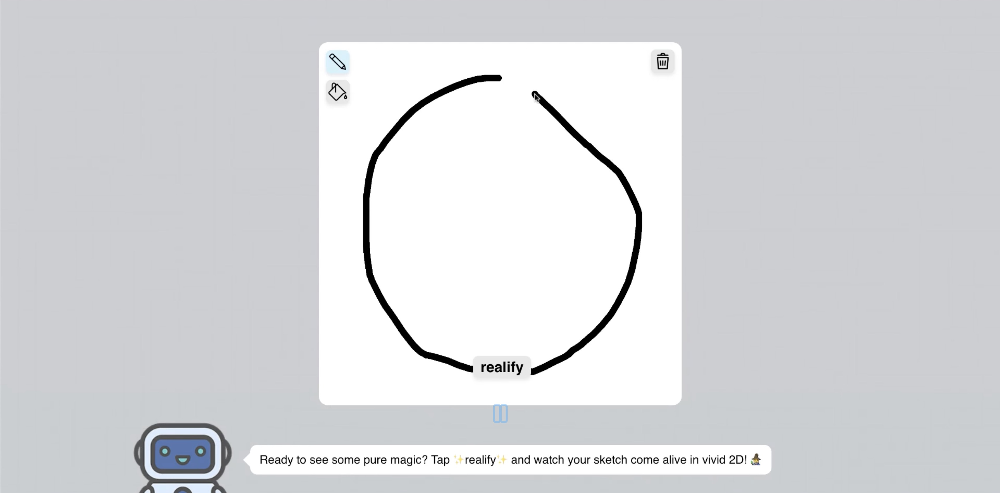

Transform your roughest scribbles to realistic face potraits, and turn those into an interactive 3d model.


## Demo Video

https://github.com/user-attachments/assets/23916501-df8a-43fc-8484-706a3fc0679b

## Realify UI



### Realify 2D pipeline


### Realify 3D model


---

## How It Works

1. **Scribble:** Draw freely on the 2D canvas. Includes draw, fill, and erase tools.
2. **realify:** Use the “realify” button to transform scribble into realistic photograph of a face  
3. **REALIFY:** Click “REALIFY” to convert your photograph into a 3D model  
4. **Iterate:** Draw another face and repeat!  

---

## Quick Start

### Prerequisites

- Conda venv
- Libraries in requirement.txt
- Controlnet diffusion model

### Program Setup
```bash
python3 -m pip install -r requirements.txt
source ~/miniconda3/etc/profile.d/conda.sh
conda activate face3d
```

### Frontend Setup

```bash
cd frontend
npm start
```

### Backend Setup

```bash
cd backend
python3 -m uvicorn main:app --reload
```

---
## Architecture

### Frontend
- **React:** Clean, responsive UI
- **Three.js:** Interactive 3D model  
- **Figma:** Initial UI design
- **Html Css, Node.js:** Styling and animations

### Backend
- **FastAPI:** Quick API frameowrk
- **Mediapipe:** 3D inferencing
- **Bash:** Convenient installation  


